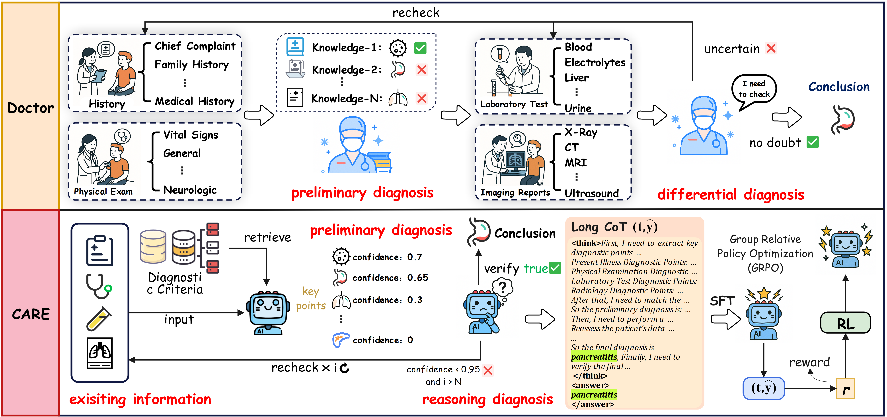
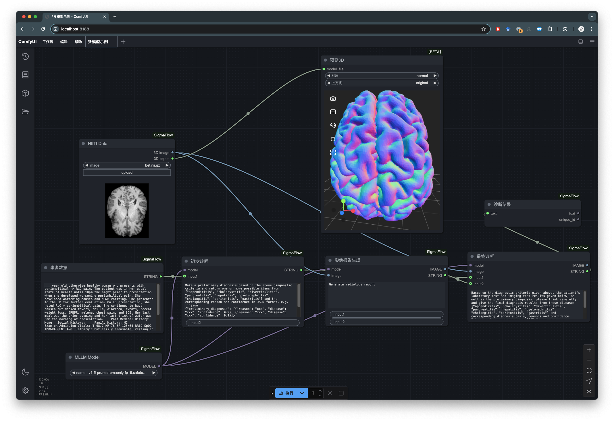

<div align="center">
  

  <h1 style="font-size: 16px; font-weight: bold;">
    CARE: A Clinical Agentic Reasoning Engine to Enhance Real-World Diagnostic Accuracy via Structured Medical Reasoning
  </h1>

  <br>

</div>

## CARE: A Clinical Agentic Reasoning Engine

<figure style="margin:16px auto; text-align:center;">
  
  <figcaption style="font-size:14px; color:#666; margin-top:8px;">
    CARE mirrors real-world diagnostic workflows with an agentic graph of model, tool, and logic nodes, covering retrieval, preliminary diagnosis, final diagnosis, and confidence-gated recheck.
  </figcaption>
</figure>

Key insights:

- **Clinical agentic workflow.** CARE encodes diagnosis as a directed graph of **model**, **tool (RAG / code)**, and **logic (branch / loop / value)** nodes, with all intermediate states serialized as JSON for **verifiable, training-free inference** and auditing.
- **End-to-end structured medical reasoning.** The pipeline decomposes decision-making into **retrieval → preliminary diagnosis → final diagnosis → recheck**, explicitly mirroring physicians’ use of history, physical examination, laboratory tests, and imaging.
- **Real-world EHR supervision.** CARE constructs a dataset of **2k+ real clinical cases** from MIMIC-IV across **15 abdominal diseases**, with stepwise annotations over \(H\), \(PE\), \(Lab\), and \(Rad\), avoiding synthetic toy scenarios.
- **DARE: Dual-stage alignment.** A two-stage alignment scheme—**SFT on CARE-style CoT** followed by **GRPO-based RL**—sharpens search, promotes self-correction, and balances long-form reasoning with final-answer accuracy.
- **CARE-Dx models.** Based on compact backbones (e.g., **LLaMA-3.1-8B-Instruct**, **Qwen2.5-7B-Instruct**), CARE-Dx achieves **in-domain** gains on abdominal diagnosis and **zero-shot out-of-domain** gains on MedBench benchmarks, often rivaling or surpassing much larger models.
- **Training-free plug-in engine.** CARE can be used as a **test-time framework** for arbitrary LLMs: routing them through the CARE workflow significantly boosts zero-shot diagnostic accuracy without re-training the backbone.
- **Clinician-validated reasoning.** In multicenter expert review with **12 physicians**, CARE-Dx’s reasoning scores higher than strong medical baselines in terms of **clinical relevance, logical coherence, evidence support, and differential coverage**, and generalizes to a broader private cohort (**Rui-EHR**) spanning eight specialties.

<figure style="margin:16px auto; text-align:center;">
  
  <figcaption style="font-size:14px; color:#666; margin-top:8px;">
    CARE data generation pipeline: retrieval of guideline-based criteria, extraction of key findings from EHR, staged diagnostic reasoning, and confidence-gated recheck loops.
  </figcaption>
</figure>

## News and Updates

- **2025** 🚀 We are going to release of **CARE-Dx-LLaMA-8B** and **CARE-Dx-Qwen-7B** checkpoints (SFT + GRPO) and inference scripts.  
- **2025-12-06** 📦 Open-source release of the **CARE agentic pipeline**, including JSON-based workflow configs, RAG tools, and evaluation code for MIMIC-IV abdominal diagnosis and Rui-EHR external validation.  

<br>


# 🚀 CARE
CARE is a Python package designed to optimize the performance of task-flow related to LLMs/MLLMs or Multi-agent.



```mermaid
graph LR
    %% ========================
    %% Nodes definition section
    %% ========================
    计算BMI[/"计算BMI"/]
    是否确诊{"是否确诊"}
    推断最有可能疾病["推断最有可能疾病"]
    身高(["身高"])
    年龄(["年龄"])
    提取症状["提取症状"]
    患者信息(["患者信息"])
    疾病列表(["疾病列表"])
    获取出生日期["获取出生日期"]
    治疗建议(["治疗建议"])
    计算年龄[/"计算年龄"/]
    体重(["体重"])
    诊断["诊断"]
    治疗推荐["治疗推荐"]
    获取身高体重["获取身高体重"]
    出生日期(["出生日期"])
    exit[["exit"]]
    症状(["症状"])
    疾病(["疾病"])
    BMI(["BMI"])
    搜索疾病列表("搜索疾病列表")

    %% ========================
    %% Links definition section
    %% ========================
    症状 --> 每个症状
    出生日期 ==> 计算年龄 ==> 年龄
    治疗建议 ==o|total: 6.26s| exit
    患者信息 ==> 提取症状 ==>|1.02s| 症状
    患者信息 ==> 获取出生日期 ==>|1.05s| 出生日期
    症状 ==> 搜索疾病列表 ==>|1.02s| 疾病列表
    患者信息 ==> 诊断 ==>|1.01s| 疾病
    身高 & 体重 ==> 计算BMI ==> BMI
    患者信息 ==> 获取身高体重 ==>|1.06s| 身高 & 体重
    疾病 ==>|1.02s| 是否确诊
    患者信息 & 疾病列表 ==> 推断最有可能疾病 ==>|1.02s| 疾病
    是否确诊 ==>|无法确定| 提取症状 & 获取出生日期 & 获取身高体重
    患者信息 & 疾病 & 年龄 & BMI ==> 治疗推荐 ==>|1.02s| 治疗建议

    %% ================
    %% Subgraph section
    %% ================
    subgraph 每个症状
        搜索疾病列表
    end

    %% ========================
    %% Style definition section
    %% ========================
    classDef LLMNODE fill:#ECE4E2,color:black
    class 获取出生日期,诊断,治疗推荐,提取症状,获取身高体重,推断最有可能疾病 LLMNODE
    classDef DATA fill:#9BCFB8,color:black
    class 疾病,症状,出生日期,BMI,体重,年龄,治疗建议,患者信息,身高,疾病列表 DATA
    classDef BRANCHNODE fill:#445760,color:white
    class 是否确诊 BRANCHNODE
    classDef CODENODE fill:#FFFFAD,color:black
    class 计算BMI,计算年龄 CODENODE
    classDef LOOPNODE fill:none,stroke:#CC8A4D,stroke-dasharray:5 5,stroke-width:2px
    class 每个症状 LOOPNODE
    classDef RAGNODE fill:#FE929F,color:black
    class 搜索疾病列表 RAGNODE
    classDef EXITNODE fill:#3D3E3F,color:white
    class exit EXITNODE
    classDef INPUTDATA fill:#D64747,color:black
    class 患者信息 INPUTDATA
    linkStyle 0 fill:none,stroke:#CC8A4D,stroke-dasharray:5 5,stroke-width:2px
````

```mermaid
gantt
title Task Timeline
dateFormat  x
axisFormat  %M:%S.%L
section pid_00
诊断: 0, 1023ms
获取身高体重: 2046, 1035ms
每个症状: 3083, 12ms
搜索疾病列表: 3095, 1024ms
搜索疾病列表: 4119, 1023ms
section pid_01
获取出生日期: 2045, 1029ms
计算BMI: 3076, 11ms
治疗推荐: 3088, 1027ms
搜索疾病列表: 4115, 1025ms
推断最有可能疾病: 5141, 1025ms
section pid_02
提取症状: 2045, 1043ms
搜索疾病列表: 3089, 1022ms
搜索疾病列表: 4112, 1021ms
section pid_03
是否确诊: 1020, 1035ms
计算年龄: 3071, 25ms
搜索疾病列表: 3096, 1022ms
搜索疾病列表: 4118, 1023ms
```

## Introduction

CARE is a Python package designed to optimize the performance of task-flow related to Large Language Models (LLMs) or Multimodal Large Language Models (MLLMs) or Multi-agent system. It ensures efficient parallel execution of task-flow while maintaining dependency constraints, significantly enhancing the overall performance.


## Features

* Dependency Management: Handles task dependencies efficiently, ensuring correct execution order.

* Parallel Execution: Maximizes parallelism to improve performance.

* Loop Handling: Supports tasks with loop structures.

* Easy Integration: Simple and intuitive API for easy integration with existing projects.


## Installation

You can install CARE via pip:


```bash
pip install CARE
```

## Quick Start

Here is a basic example to get you started:


<details>
<summary>Example Code</summary>

```python
from CARE import CARE, Prompt

# set custom prompt
example_prompt = Prompt("""
...
{inp1}
xxx
""", keys=['{inp1}'])

# set api
def llm_api(inp):
    ...
    return out

def rag_api(inp):
    ...
    return out

# set input data
data = {
    'inp': 'test input text ...',
}

# set pipeline
demo_pipe = {
    'process_input': {
        'prompt': example_prompt,
        'format': {'out1': list, 'out2': str}, # check return json format
        'inp': ['inp'],
        'out': ['out1', 'out2'],
        'next': ['rag1', 'loop_A'], # specify the next pipeline
    },
    'rag1': {
        'rag_backend': rag_api2, # specific api can be set for the current pipe via 'rag_backend' or 'llm_backend'.
        'inp': ['out2'],
        'out': 'out8',
    },
    'loop_A': { # here is iterating over a list 'out1'
        'inp': 'out1',
        'pipe_in_loop': ['rag2', 'llm_process', 'rag3', 'rag4', 'llm_process2', 'llm_process3'],
        'next': ['exit'], # 'exit' is specific pipe mean to end
    },
    'rag2': {
        'inp': ['out1'],
        'out': 'out3',
    },
    'llm_process2': {
        'prompt': llm_process2_prompt,
        'format': {'xxx': str, "xxx": str},
        'inp': ['inp', 'out4', 'out8'],
        'out': 'final_out1',
    },
    ...
}

# running pipeline
pipeline = CARE(demo_pipe, llm_api, rag_api)
result, info = pipeline.run(data, core_num=4, save_pref=True)
```

</details>

Logs are stored in the `logs` folder. If `save_pref` is `true`, you can see the relevant performance report.


For a complete example, please refer to the example directory.


## Start with CLI Mode

> We have updated a more easy-to-use command to run pipeline.

```bash
CARE -p example/demo_pipeline.py -i example/demo_data.json -m async
```

Command Options:

```text
options:
  -h, --help            show this help message and exit
  -p PIPELINE, --pipeline PIPELINE
                        specify the pipeline to run
  -i INPUT, --input INPUT
                        specify input data
  -o OUTPUT, --output OUTPUT
                        specify output data
  -m {async,mp,seq}, --mode {async,mp,seq}
                        specify the run mode
  --split SPLIT         split the data into parts to run
  --png                 export graph as png
  --test                run test
```

## Documentation

For detailed documentation, please visit the official documentation page of CARE.


## Contributing

We welcome contributions from the community. Please read our contributing guide to get started.


## License

CARE is licensed under the Apache License Version 2.0. See the [LICENSE](./LICENSE) file for more details.

## Acknowledgements

Special thanks to all contributors and the open-source community for their support.

特别感谢所有贡献者和开源社区的支持。

## Contact

For any questions or issues, please open an issue on our GitHub repository:
[https://github.com/SII-WenjieLisjtu/CARE](https://github.com/SII-WenjieLisjtu/CARE)

## 🌟 Citation

```python
@book{WenjieLisjtu,
    title = {SII-WenjieLisjtu/CARE},
    url = {https://github.com/SII-WenjieLisjtu/CARE},
    author = {WenjieLisjtu},
    date = {2025-12-06},
    year = {2025},
    month = {12},
    day = {6},
}
```

